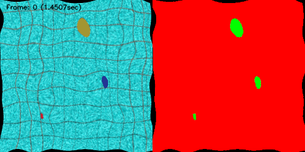

# PyTVision
[](https://pytorchvision.readthedocs.io/en/latest/?badge=latest)

The pytvision package consists of my datasets, models, and image transformations methods for computer vision projects. This package also containing the synthetic render methods.

## Installation

From source:

    python setup.py install

## Books

- [Example transformation](https://github.com/pedrodiamel/pytorchvision/blob/master/books/example_transforms.ipynb)
- [Example transformation for pytorch](https://github.com/pedrodiamel/pytorchvision/blob/master/books/example_tranforms_pytorch.ipynb)

## Documentation
The full documentation is available at [doc](https://pytorchvision.readthedocs.io/en/latest/)


## Transforms

The backend transforms using opencv




### Color transformation

    transform = mtrans.RandomBrightness( factor=0.75 )
    transform = mtrans.RandomBrightnessShift( factor=0.5 )
    transform = mtrans.RandomContrast( factor=0.3 )
    transform = mtrans.RandomSaturation( factor=0.75 )
    transform = mtrans.RandomHueSaturationShift( factor=0.75 )
    transform = mtrans.RandomHueSaturation( hue_shift_limit=(-5, 5), sat_shift_limit=(-11, 11), val_shift_limit=(-11, 11) )
    transform = mtrans.RandomRGBShift()
    transform = mtrans.RandomGamma( factor=0.75  )
    transform = mtrans.RandomRGBPermutation()
    transform = mtrans.ToRandomTransform(mtrans.ToGrayscale(), prob=0.5)
    transform = mtrans.ToRandomTransform(mtrans.ToNegative(), prob=0.5)
    transform = mtrans.ToRandomTransform(mtrans.CLAHE(), prob=0.5) 

### Blur + Noise transformation

    transform = mtrans.ToLinealMotionBlur( lmax=1 )
    transform = mtrans.ToMotionBlur( ) 
    transform = mtrans.ToGaussianBlur() 


### Geometrical transformation

    transform = mtrans.RandomElasticDistort( size_grid=50, deform=15, padding_mode=cv2.BORDER_REFLECT_101)
    transform = mtrans.ToRandomTransform(mtrans.ToResize( (255,255) ), prob=0.85)
    transform = mtrans.ToRandomTransform(mtrans.ToResizeUNetFoV( 388), prob=0.85)
    transform = mtrans.RandomCrop( (255,255), limit=100, padding_mode=cv2.BORDER_CONSTANT  )
    transform = mtrans.RandomScale(factor=0.5, padding_mode=cv2.BORDER_CONSTANT )
    transform = mtrans.ToRandomTransform(mtrans.HFlip(), prob=0.85)
    transform = mtrans.ToRandomTransform(mtrans.Rotate270(), prob=0.85)
    transform = mtrans.RandomGeometricalTranform( angle=360, translation=0.5, warp=0.02, padding_mode=cv2.BORDER_CONSTANT)


## Building the documentation
1. Go to `docs/` directory
```
cd docs
```
2. Install required libraries
```
pip install -r requirements.txt
```
3. Build html files
```
make html
```
4. Open `_build/html/index.html` in browser.


